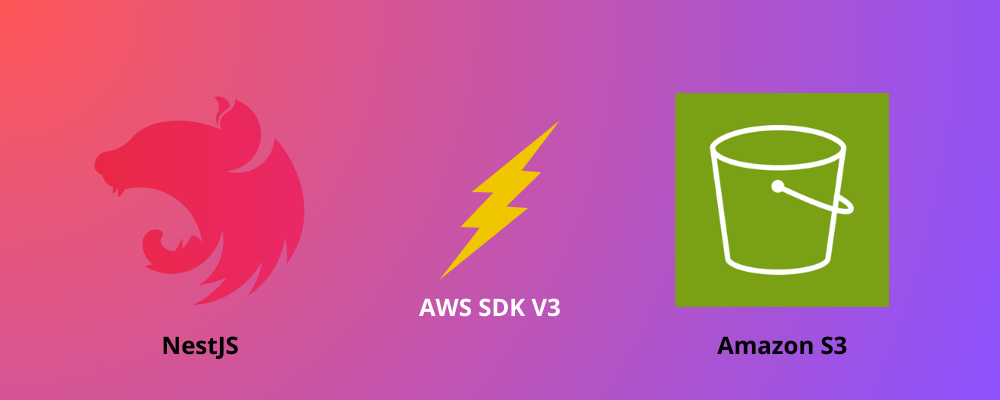

# @open-nebel/nest-s3

[](https://www.npmjs.com/package/@open-nebel/nest-s3)
[](https://www.npmjs.com/package/@open-nebel/nest-s3)



A NestJS module for interacting with AWS S3. This module simplifies the integration of AWS S3 within a NestJS application by providing injectable services and configuration options.

**Note**: This library is compatible with AWS SDK V3.

> **AWS SDK Version 2.x Upcoming End-of-Support**
>
> We [announced](https://aws.amazon.com/blogs/developer/announcing-end-of-support-for-aws-sdk-for-javascript-v2) the upcoming end-of-support for AWS SDK for JavaScript v2. We recommend that you migrate to [AWS SDK for JavaScript v3](https://docs.aws.amazon.com/sdk-for-javascript/v3/developer-guide/welcome.html). For dates, additional details, and information on how to migrate, please refer to the linked announcement.
>
> The AWS SDK for JavaScript v3 is the latest and recommended version, which has been GA since December 2020. Here is [why and how you should use AWS SDK for JavaScript v3](https://aws.amazon.com/blogs/developer/why-and-how-you-should-use-aws-sdk-for-javascript-v3-on-node-js-18/). You can try our experimental migration scripts in [aws-sdk-js-codemod](https://www.npmjs.com/package/aws-sdk-js-codemod) to migrate your application from v2 to v3.

## Installation

To install the package, use the following commands:

```bash
npm install @open-nebel/nest-s3
```

or

```bash
yarn add @open-nebel/nest-s3
```

## Usage

### Configuration

You can configure the S3 module using either synchronous or asynchronous configuration.

#### Synchronous Configuration

```typescript
import { Module } from '@nestjs/common';
import { S3Module } from '@open-nebel/nest-s3';

@Module({
  imports: [
    S3Module.forRoot({
      region: 'your-region',
      accessKeyId: 'your-access-key-id',
      secretAccessKey: 'your-secret-access-key',
    }),
  ],
})
export class AppModule {}
```

#### Asynchronous Configuration

```typescript
import { Module } from '@nestjs/common';
import { ConfigModule, ConfigService } from '@nestjs/config';
import { S3Module } from '@open-nebel/nest-s3';

@Module({
  imports: [
    ConfigModule.forRoot(),
    S3Module.forRootAsync({
      imports: [ConfigModule],
      inject: [ConfigService],
      useFactory: (configService: ConfigService) => ({
        region: configService.get<string>('AWS_REGION'),
        accessKeyId: configService.get<string>('AWS_ACCESS_KEY_ID'),
        secretAccessKey: configService.get<string>('AWS_SECRET_ACCESS_KEY'),
      }),
    }),
  ],
})
export class AppModule {}
```

### Using the S3Service

The `S3Service` provides methods to interact with AWS S3, such as creating buckets, uploading objects, and generating presigned URLs.

#### Example Usage in a Service

```typescript
import { Injectable } from '@nestjs/common';
import { S3Service } from '@open-nebel/nest-s3';

@Injectable()
export class MyService {
  constructor(private readonly s3Service: S3Service) {}

  async useS3Methods() {
    const bucketName = 'your-bucket-name';
    const key = 'your-file-key';
    const body = 'your-file-content';

    // Create a bucket
    await this.s3Service.createBucket(bucketName);

    // Upload an object
    await this.s3Service.uploadObject(bucketName, key, body);

    // Get an object
    const objectContent = await this.s3Service.getObject(bucketName, key);
    console.log('Object Content:', objectContent);

    // Generate a presigned URL
    const presignedUrl = await this.s3Service.createPresignedUrlWithClient({ bucket: bucketName, key });
    console.log('Presigned URL:', presignedUrl);

    // Delete an object
    await this.s3Service.deleteOneObject(bucketName, key);

    // Delete all objects in the bucket
    await this.s3Service.deleteAllObjects(bucketName);

    // Delete the bucket
    await this.s3Service.deleteBucket(bucketName);
  }
}
```

### Available Methods

#### `createBucket(bucketName: string): Promise<void>`

Creates a new S3 bucket with the specified name.

```typescript
await this.s3Service.createBucket('my-new-bucket');
```

#### `uploadObject(bucketName: string, key: string, body: string): Promise<void>`

Uploads an object to the specified S3 bucket.

```typescript
await this.s3Service.uploadObject('my-new-bucket', 'my-object-key', 'Hello, world!');
```

#### `getObject(bucketName: string, key: string): Promise<string | undefined>`

Retrieves an object from the specified S3 bucket.

```typescript
const content = await this.s3Service.getObject('my-new-bucket', 'my-object-key');
console.log('Object content:', content);
```

#### `deleteOneObject(bucketName: string, key: string): Promise<void>`

Deletes an object from the specified S3 bucket.

```typescript
await this.s3Service.deleteOneObject('my-new-bucket', 'my-object-key');
```

#### `deleteAllObjects(bucketName: string): Promise<void>`

Deletes all objects from the specified S3 bucket.

```typescript
await this.s3Service.deleteAllObjects('my-new-bucket');
```

#### `deleteBucket(bucketName: string): Promise<void>`

Deletes the specified S3 bucket.

```typescript
await this.s3Service.deleteBucket('my-new-bucket');
```

#### `createPresignedUrlWithClient(params: { bucket: string; key: string }): Promise<string>`

Generates a presigned URL for accessing an object in the specified S3 bucket.

```typescript
const presignedUrl = await this.s3Service.createPresignedUrlWithClient({ bucket: 'my-new-bucket', key: 'my-object-key' });
console.log('Presigned URL:', presignedUrl);
```

## License

This project is licensed under the MIT License. See the [LICENSE](LICENSE) file for details.

## Contributing

Contributions are welcome! Please feel free to submit a pull request or open an issue on GitHub.

## Acknowledgements

This package uses the AWS SDK for JavaScript (v3) and is inspired by the design principles of NestJS.

## Support

If you encounter any issues or have any questions, feel free to open an issue on GitHub or contact the maintainers.

---